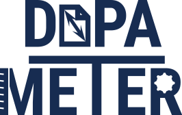

----

[](https://github.com/dopameter/dopameter/blob/main/LICENSE)


[](https://github.com/dopameter/dopameter/blob/main/README.md)


----

# DOPA METER - A Tool Suite for the Metrical Document Profiling and Aggreation

This is _DOPA METER_ - a tool suite that subsumes a wide range of established metrics of text analysis under one coverage.
It is based on [Python 3](https://www.python.org/) and [spaCy](https://spacy.io/).
(Running is preferred under Linux (preferred [Ubuntu](https://ubuntu.com/)) and partly under Microsoft Windows.)

The system is based by a modular architecture, including a multilingual approach.
It is designed in a decentralized manner estimating features of various sources at different places and merge partial results.

Three components build the basis:
  1. _Text corpora_ as the input and possible to summarize into collections such as a preprocessing pipeline,
  2. _Feature Hub_: A set of features, that compute _counts_ and _metrics_ of text corpora and
  3. A three-parted _analytics section_:
     1. Summarization mode: of simple reports for whole corpora and single documents, 
     2. Comparison: simple comparisons (e.g., vocabulary, $n$-grams) via intersections and differences
     3. Aggregation: clustering by _k_-means and _t_-SNE with _DBSCAN_

## Functionality


## Quick Introduction

* Installation
  * Install [Python 3](https://www.python.org/)
  * Install [spaCy language modules](https://spacy.io/models) and other external resources via `python install_languages.py lang_install.json`
    * Working for German and English language and all spaCy compatible languages or languages modules.
    * Warnings:
      * Constituency metrics use the [Berkeley Neural Parser](https://github.com/nikitakit/self-attentive-parser), [check](https://askubuntu.com/questions/633176/how-to-know-if-my-gpu-supports-cuda) if your device is CUDA compatible.

* Starting _DOPA METER_
  * Configure your text corpora: one corpus is set up by a directory including single text files
    * [Example corpora set up](documentation/resources/example_corpora)
* Configure your config.json
  * [Example configuration files](documentation/resources/example_configurations)
  * Very simple example:
 
 
```json lines 
{
  "corpora": {
    "name_corpus": {
      "path_text_data": "/path/of/your/corpus/files/",
      "language":       "de",
      "collection":     "one"
    },
    "name_other_corpus": {
      "path_text_data": "/path/of/your/corpus/files/",
      "language":       "de",
      "collection":     "two"
    },
    "name_one_more_corpus": {
      "path_text_data": "/path/of/your/corpus/files/",
      "language":       "de",
      "collection":     "two"
    }
  },
  "settings": {
    "tasks": ["features", "counts", "corpus_characteristics"],
    "store_sources": false,
    "file_format_features": ["csv"],
    "file_format_dicts": "txt"
  },
  "output": {
      "path_features": "/define/a/path/of/your/features",
      "path_summary":  "/define/a/path/of/your/summary",
      "path_counts":   "/define/a/path/of/your/counts"
    },
  "features": {
    "token_characteristics": "default",
    "surface":               "default"
  }
}
```

* Open a terminal, root in the directory of _DOPA METER_ and type `python main.py config.json` 

## Detailed Documentation

1. [Installation](documentation/installation.md)
2. [Input and Data Preparation](documentation/input.md)
3. [Functionality and Definition of Tasks](documentation/tasks.md)
4. [Feature Hub](documentation/features.md)
5. [Analytics](documentation/analytics/analytics.md)
   * [Summarization](documentation/analytics/summarization.md)
   * [Comparison](documentation/analytics/comparison.md)
   * [Aggregation](documentation/analytics/aggregation.md)
6. [Configuration and Run](documentation/configuration.md)

## How to cite

DOPA METER is presented at [EMNLP 2023 Demo](https://aclanthology.org/volumes/2023.emnlp-demo/).

* [Paper EMNLP 2023 Demo](https://aclanthology.org/2023.emnlp-demo.18/)
* [Poster EMNLP 2023 Demo](documentation/poster_DOPA_METER_EMNLP23.png)
* [Short intro slides](documentation/introslides_DOPA_METER_EMNLP23.pdf)

Please use the following citation:

    @inproceedings{lohr-hahn-2023-dopa,
        title = "{DOPA} {METER} {--} A Tool Suite for Metrical Document Profiling and Aggregation",
        author = "Lohr, Christina and Hahn, Udo",
        editor = "Feng, Yansong and Lefever, Els",
        booktitle = "Proceedings of the 2023 Conference on Empirical Methods in Natural Language Processing: System Demonstrations",
        month = dec,
        year = "2023",
        address = "Singapore",
        publisher = "Association for Computational Linguistics",
        url = "https://aclanthology.org/2023.emnlp-demo.18",
        pages = "218--228",
        abstract = "We present DOPA METER, a tool suite for the metrical investigation of written language, that provides diagnostic means for its division into discourse categories, such as registers, genres, and style. The quantitative basis of our system are 120 metrics covering a wide range of lexical, syntactic, and semantic features relevant for language profiling. The scores can be summarized, compared, and aggregated using visualization tools that can be tailored according to the users{'} needs. We also showcase an application scenario for DOPA METER.",
    }

## Licence

[](https://github.com/dopameter/dopameter/blob/main/LICENSE)

DOPA METER is provided as open source under the [MIT License](https://docs.github.com/en/repositories/managing-your-repositorys-settings-and-features/customizing-your-repository/licensing-a-repository#searching-github-by-license-type).

# Funding and Support

This work was supported by the [Friedrich Schiller University Jena](https://www.uni-jena.de/) ([JULIE Lab](https://julielab.de) and [FUSION group](https://www.fusion.uni-jena.de/)) and the [University Leipzig](https://www.uni-leipzig.de/) ([IMISE](https://www.imise.uni-leipzig.de/)), such as
the [BMBF](https://www.bmbf.de/) within the projects [SMITH](https://www.smith.care) (grants 01ZZ1803G and 01ZZ1803A) and [GeMTeX](https://www.smith.care/en/gemtex_mii/) as parts of the [Medical Informatics Initiative Germany](https://www.medizininformatik-initiative.de/en/start).
